---
tags:
  - design-patterns
---
# Adapter

![[Adapter]]

# Bridge
![[Bridge]]
# Composite

![[Composite]]

## ML Example

- `Neuron` struct
- `Neuron`s have connections for other Neurons (in and out)
- Every Neuron has a unique ID

```cpp
struct Neuron
{
	std::vector<Neuron*> in, out;
	unsigned int id;

	Neuron() 
	{
		static int id{1};
		this->id = id++;
	}

	void connect_to(Neuron& other)
	{
		out.push_back(&other);
		other.in.push_back(this);
	}
};
```

Neuron also has a stream output operator
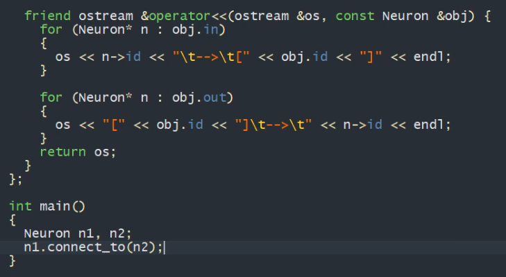

- This does not yet allow to connect multiple neurons
- Let’s add `NeuronLayers`
> [!warning] Bad style
> Do not inherit from vector

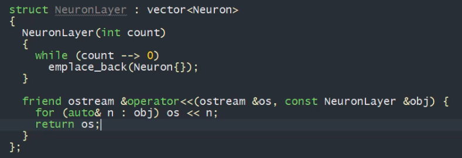

- Problem: We want to connect
	- All neurons from a layer to a single neuron
	- Single neuron to layer
	- Layer to layer
	- Neuron to neuron (all done)

- => State space explosion for connections
- Let’s introduce a new interface using [[CRTP]] `SomeNeurons`
- This will be used in Neuron and NeuronLayer
- [[CRTP]] is used to deduct which type we have
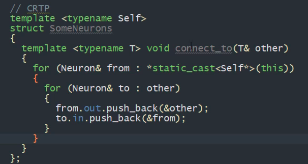

- 👆 This is the single function that connects all Neurons together
- Ranged based for loop will need to be implemented by adding begin and end functions
- For single neuron (arrrg!)
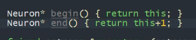

## Intersection of Composite and Proxy

- Example of creature in computer game with certain statistics
	- Str, int, agi , …
	- This requires some getters and setters
	- Some aggregate statistics might be required (max, average, sum …)
	- This approach does not scale for multiple properties
- Having separate fields does not bring any benefit
- Let’s use something called “array backed properties”
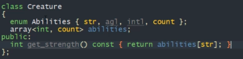

- Same for setter. Calculating aggregate statistics becomes very simple
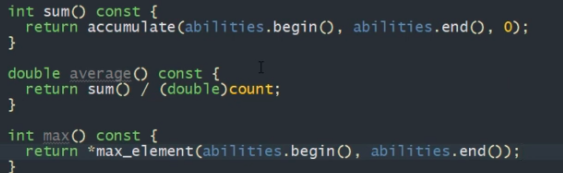

> [!summary]
> - Objects can use other objects either by composition or inheritance
> - Sometimes they need similar behaviours
> - The Composite design pattern lets us treat scalar and composite objects similarly
> - C++ supports “duck typing” when using begin() and end() objects and ranged based for loops

# Decorator

- Allows to augment an object with additional functionality
- No need to rewrite existing code
- Keeping existing functionality
- In C++ there are two options:
	- Aggregate decorated object
	- Inherit from the decorated object
- “Facilitates the addition of behavior to individual objects”

## Dynamic Decorator

- Base class `Shape` and implementation `Circle`
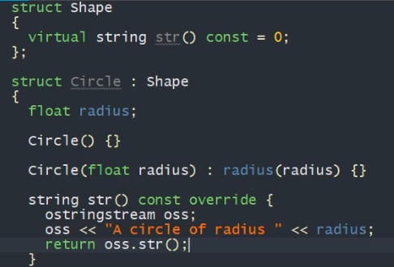

- We can also add `Square`s
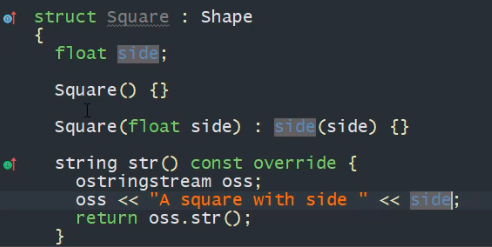

- Now we want to have color. Bad idea: Add two more classes “colorsquare” and “colorcircle”
- Instead: Use Decorator


- Dynamic because we use inheritance
- Let’s add TransparentShape
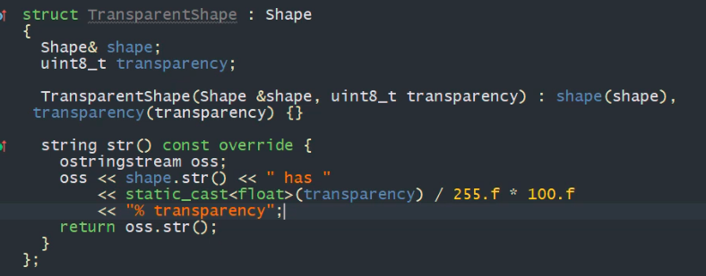

- -> both colored and transparent
> [!warning] Downside
Once you decorate a type, you are restricted to the interface

## Static Decorator

- Use some c++ tricks to bake information about decorator into the type
	- Mixin Inheritance ([[CRTP]])
	- Perfect Forwarding
- [[CRTP]] allows to call members of the base class


- Use concepts to check that decorator is used in the correct underlying types
- Let’s use constructor forwarding with argument packs to use constructors of the base class

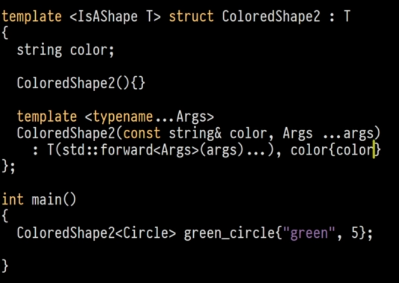

- We hope that the baseclass has a matching constructor that works with the passed arguments
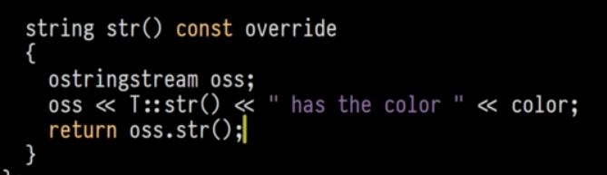

- We still need to write functions manually of course
- Applying decorator on a decorator:
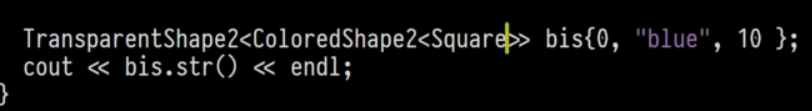

- Through inheritance, `bis` is a `Square`, a `ColoredShape2` and a `TransparentShape2`.
- Members can be modified easily, even if they are not part of the interface

## Functional Decorator

- For now we were decorating a class
- Now let’s make a functional decorator to decorate functions

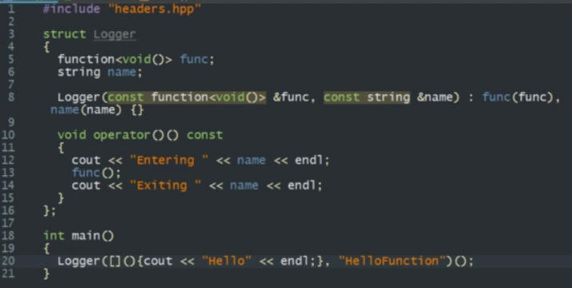

- Instead of storing `std::function`, we can use a Template (which has some challenges)
- Template argument of class can not be inferred
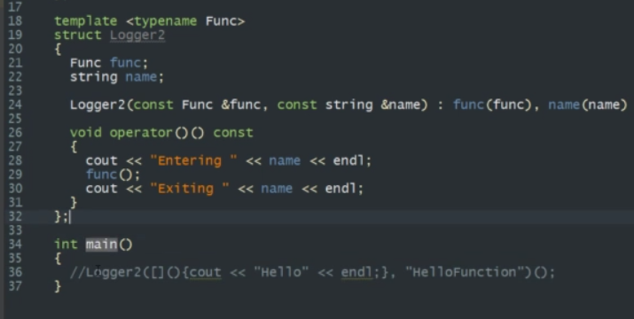

- We can create a helper function that avoids the error by explicitly providing the template argument
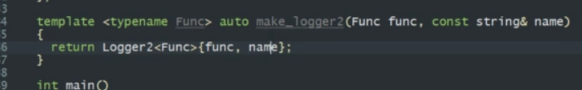

- Currently no arguments and no return value. Now it gets interesting
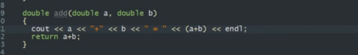

- The decorator now needs to be more complicated. We will need to use variadic templates.
- Also we need to allow for partial specialization by providing a generic template (line 45)
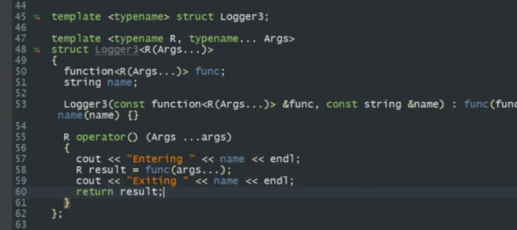

- We will need another helper function. We take a function pointer and create an std::function from it.
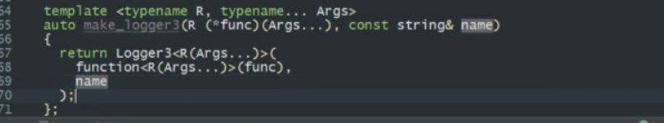
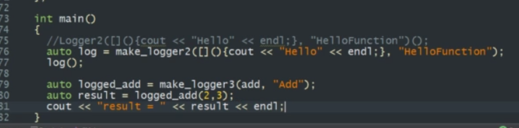

> [!summary]
> - A dynamic decorator keeps the reference to the decorated object(s)
> - A static decorator uses mixin inheritance
> 	- `ColoredShape<Square>`
> - Both approaches allow limitless composition
> 	- `TransparentShape<ColoredShape<Circle>>`

# Facade

> [!quote] Expose several components through a single interface

> [!quote] Provides a simple, easy to understand interface over a large, complicated code base

> [!example]
> - House is a system which needs to balance complexity and presentation/usability
> - The end user is not exposed to the internal details

> [!example] Without facace
> 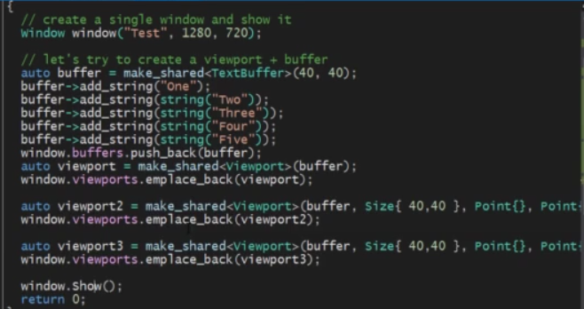

> [!example] With a facade
> 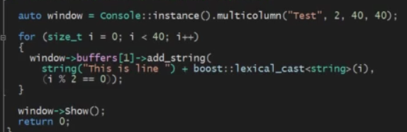

- Wrap a complicated API into a single method
- Optionally allow users to use the more complicated API behind the facade

# Flyweight

- Concerned with Space optimization, avoid redundancy when storing data
- E.g. MMORPG user name storage. Many names are very common, so let’s not waste space on storing all of them individually
	- Store a list of names, use indices or pointers to the names
- E.g. ranges/stringview
- A space optimization technique which lets us use less memory by storing externally the data associated with similar objects and reference to it, when needed
- Let’s stick with the mmorpg example

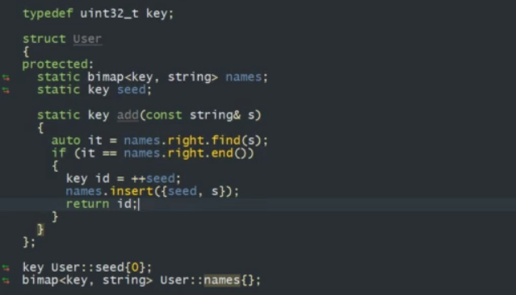

- How to create users and get names?

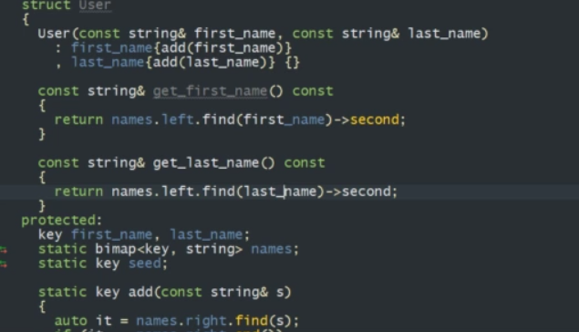

- Boost offers a convenient library for flyweights
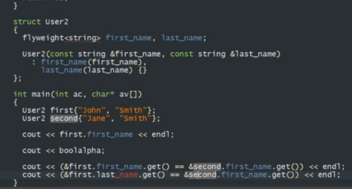

- Flyweight can also be used for text formatting
- Formatted text is initialized by plain text. Some part of the plain text should be capitalized.
- Naive approach: Store an array of bools as long as the text and check the array while printing
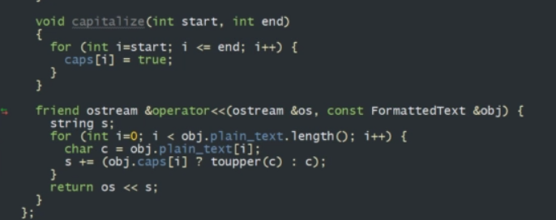

- Actually we do not need to store a bool array for each class. Using a range is sufficient

- Create a nested class TextRange, which stores begin and end

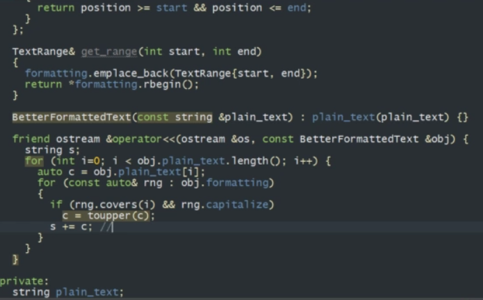

> [!summary]
>  - Store common data externally
> 	 - e.g. static map
>  - Define the idea of `ranges`on homogeneous collections
> 	 - store data related to those ranges

# Proxy

> [!quote] Interface for accessing a particular resource
>

- The interface looks like the interface of the object you want to access
- Same interface but entirely different internal behavior
- A class that functions as an interface to a particular resource which may be remote, expensive to construct or may require logging or any other added functionality
- Best Example: Smart Pointers.
	- Same functionality as with a raw pointer, but with some extensions available and very different underlying behavior.

## Property Proxy

- In C# there are properties, which is a member with a getter and setter
- Take care of assignment and access and add special behavior
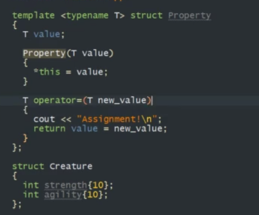

## Virtual Proxy

- Example:
	- Image interface with single interface function draw() = 0
	- Bitmap is an Image
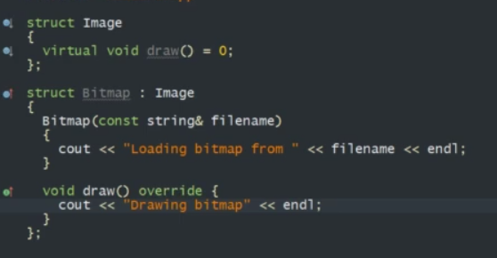

- Drawback: We do not actually need to load the bitmap unless someone wants to draw it
- We can build a virtual Proxy (LazyBitmap) which follows the interface of the bitmap, but it is actually a lazy proxy which only loads the bitmap when draw is called

- In draw we check if the bitmap has been loaded and then actually load it once.
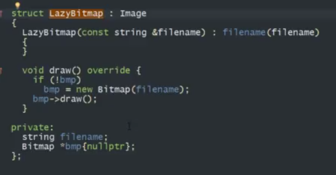

## Communication Proxy

- We start with a “Pingable” Interface with single function `ping (std::string const& message) = 0`
- Then we have a Struct Ping, which inherits from Ping.
- A Function `tryit(Pingable& pp)`, which calls ping
- Lets create a RemotePong class that uses the same interface (ping) but connects to a REST service.
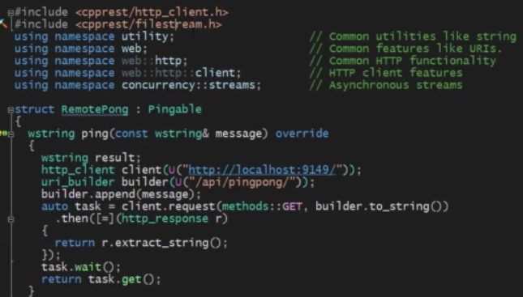

- In main we only need to replace `Pong` with `RemotePong`
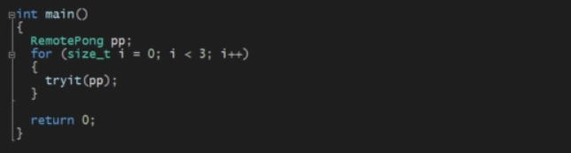

## Proxy Vs Decorator

- They are really similar
- Proxy provides an identical interface, decorated provides an enhanced interface
- Decorator typically aggregates, Proxy can be a brand new object, not related to the original implementation at all
