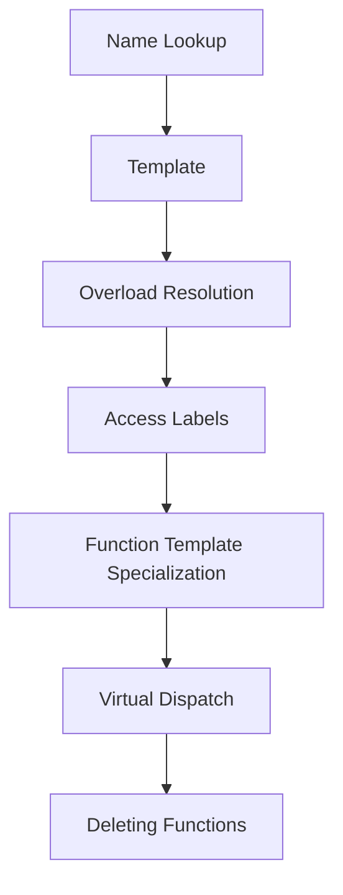

---
tags:
  - Talk
  - cpp
created: 2020-10-08
links: "[[Talks MOC]]"
---
# General Remarks

- Focus on basi mechanics
- Point out surprising details
- Give further References

- The introduced approach is one-way only. If an error occurs, never go back and report the error



# Name Lookup

- Find (visible) candidate functions
- Qualified and unqualified lookup
    - qualified lookup always searches for a specific function
    - unqualified lookup finds the best match in the current scope. If nothing is found, continue search at higher scope. If something is found, return it without further lookup

```cpp
void f(double); // (1)
namespace N1 {
	void f(int); // (2)
}


int main()
{
	f(1.0);     // unqualified lookup: calls (1)
	f(42);      // unqualified lookup: calls (1)
	N1::f(42);  // qualified lookup: calls (2)
}
```

- Functions in a scope/namespace hides functions from above scop
- Lookup only takes the name into account
- Name lookup is only looking at the name, will also find e.g. constexpr variable
- If (2) is missing, that call fails of course, because there is no function in N1

```c++
namespace N1 {
	void f(int);      // (2)
	void g() {N1::f(1.0);}
	void h() {f(1.0);}
}

int main()
{
	N1::g();      // qualified lookup: calls (2)
	N1::h();      // qualified lookup: calls (2)
	
}
```

- f inside N1 hides f outside N1, because the compiler will always take the function closes to the caller
- Name lookup also works for types or variables.

```c++
void f (double); // (1)
namespace N1 {
	void f(int); // (2)

	void g() { ::f(1.0); }  // qualified lookup, calls (1)
	void h() { f(1.0); }    // unqualified lookup, calls (2)
}

```

- g() will call (1), because leading ::f() is qualified lookup from the global namespace
- name lookup only takes into account the functions known yet to the compiler, so order of functions matters
    - This is also true if you wrap it in a struct
- base and derived classes: Name lookup searches in derived class, if it finds something, functions from base are not found.
- ADL works differently:

# Argument Dependent Lookup

```c++
void f(double);     // (1)

namespace N1 {
	void f(int);    // (2)
	struct S{};
	void f (S);     // (3)
}


int main()
{
	N1::S s{};
	f(s);           // ADL: calls (3)  
}
```

- `S` is from N1, so the compiler searches N1 for a matching function

> [!warning] ADL only works for user-defined types

```c++
namespace N1 {
	struct S {};
	void swap (S&, S&); // (1)
}
template <typename T> void g(T& a, T& b)
{
	std::swap( a, b );
}

int main()
{
	N1::S s1{};
	N1::S s2{};
	g(s1, s2);  // qualified lookup via std::, thus calls std::swap
}
```

- if `using naemspace std::` and non-qualified `swap()`, ADL would work and call (1)
- ADL can be a great match
- Core guidelines C165 using for customization points

# Template Argument Deduction

out of scope

- SFINAE => A souocon of SFINAE
- Instantiation to be called
- => Scott Meyers “Type deduction and why you care”

# Overload Resolution

- Find the candidate that is the best match
- Two Steps:
    - Compile a list of viable candidates
        - f(42);
        - void f(int) 		// exact/identity match
        - void f(int const& ) 	// trivial conversion
        - void f(double) 		// standard conversion
        - void f(Widget) 		// User-defined Conversion
        - void f(int, int = 0);	// default arguments
        - void f(integral auto)	// matching constraints
        - void f(...)		// Ellipsis argument
        - // not viable
        - void f()			// less parameters
        - void f(int, doubld)	// more parameters
        - void f(std::string)	// No conversion available
        - void f(floating_point auto) // violated constraints
    - Find the best match
        - For single parameter
            - Rank1
                - exact/Identity match
                - Trivial conversion
            - Rank 2
                - Promotion
                - Promotion + trivial conversion
            - Rank 3
                - Standard Conversion
                - Standard + trivial conversion
            - No official Rank
                - User Defined conversion (UDC)
                - UDC + trivial
                - UDC + standard
            - Even more out
                - Ellipsis
        - Within One Rank:

```c++
void f(int&); // (1) <- Identity match (rank 1)
void f(double&); // (2) <- Standard conversion  (rank 3)
void f(const int&); // (3) <- Trivial conversion  (rank 1)

int main()
{
	int i = 42;
	f(i); // calls (1), identity match, rank 1)
}
```

- f(float), f(double) <- ambiguous & compiler error
    - Templates:
        - void f(int) and void f(integral auto)
        - template function can be instantiated and will be the same. Compiler will select non-template function
    - Special Promotions (not similar conversion!)
        - integral promotions:
            - unsigned short -> unsigned int or int
            - short -> int
            - char -> int or unsigned int
            - bool -> int
        - Floating point conversion
            - float -> double
        - integral promotions are preferred to standard conversions
    - Standard conversions:
        - integral, floaing point conversions
        - integral to float, float to int
        - pointer conversions (derived to base, conversions to void*)
            - pointer conversion in deep inheritance hierarchy: closest base class is called
        - bool expression
    - User-Defined conversions
        - ranked lower than standard conversions
- Multiple paramers
    - Multiple arguments: compiler uses same rules. If f1 and f2 are equal in all parameters, but f1 is better in one or multiple arguments, f1 is selected. Else the function is ambiguous
    - Guideline: Avoid complex overloading situations which may result in surprising overload resolution
    - Guidelie: Overload only for operations that are roughly equivalent

# Access Labels (private/public)

- Check if function can be called (private?)
- will be done only after the function is resolved
- class is a “glass”: Everything is visible and access rights are only checked afterwards

# Function Template Specialization

- Function temaplte specializations are selected only after the base template function has been selected, narrowing down the possible options.
- Guideline: Prefer function overloading to function template specialization

# Virtual Dispatch

out of scope

# Deleting Functions

- is a function deleted?
- overload is selected first, delete is checked afterwards.
- This will trigger a compiler error.
- Similar to access labels
