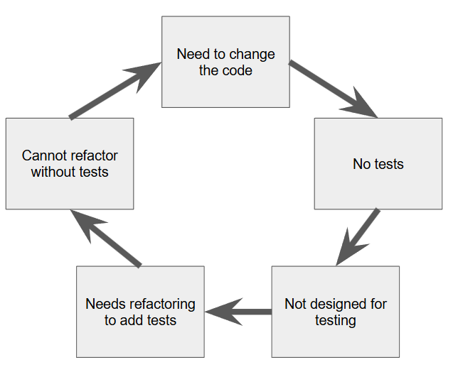
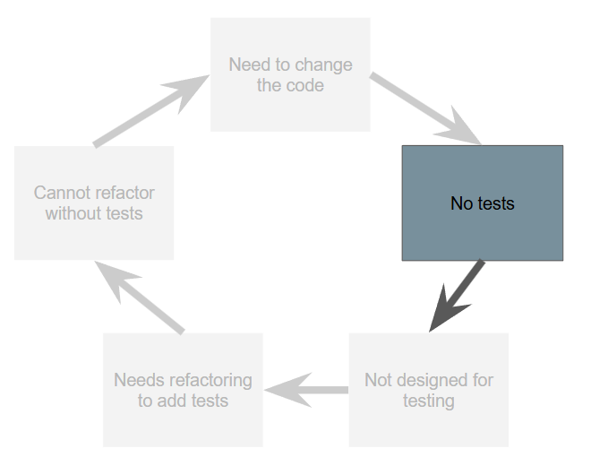
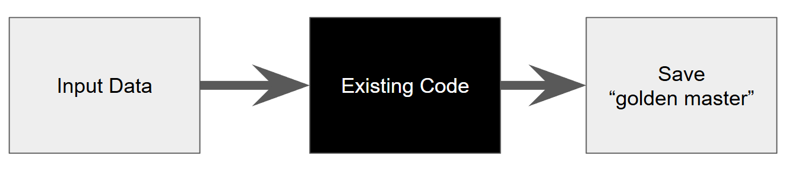
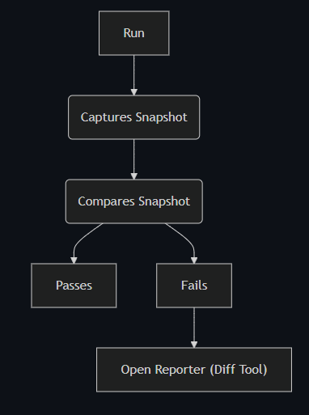
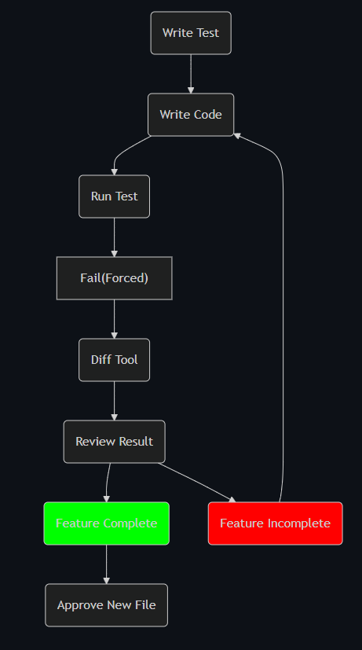

# Approval Tests

### Taming Legacy Code

**Simon Weis**

2024-11-05

---

# Legacy Code

- "Property you receive after someone has died" (Dictionary)
- "Code without unit tests" (Micheal Feathers)
- "Code that you want to change but are afraid to" (Kate Gregory)

---

# Loop of Doom

---

# Loop of Doom

---

# Assumptions

- Known value of automated tests
- The current code is working (at least for the happy path)

---

# Fixing the Behaviour

- Known set of inputs -> expected set of outputs
- The code is treated as a blackbox
- Approved output ("somehow serialized")

---

---

---

# Approval Tests

- Streamlined and unified approach
- Good to start testing legacy code
- Good when the goal is to keep behavior
- More than a simple assert, less than a system test

---

# Supported Languages

Python, C++, .Net, Java, Perl, Rust, PHP, Lua, NodeJs, Objective-C, Swift, ...

---

# Live Demo
