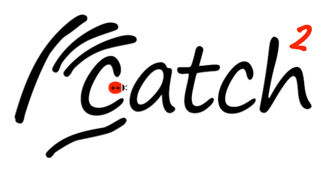
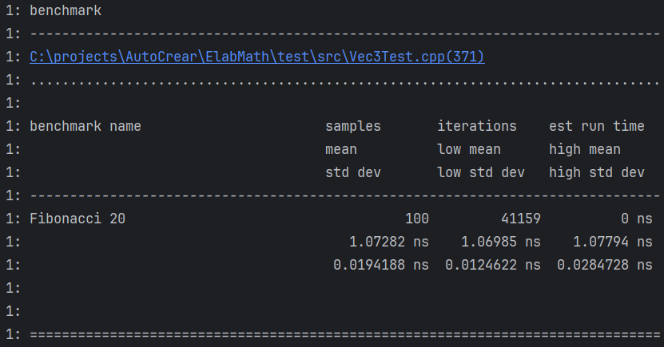

# Catch2

[comment]: <> (Build with `marp.exe .\Catch2.md --pdf --allow-local-files`)



2025-02-25

---

# Overview of Catch2

- Modern c++14 testing framework
- No external dependencies
- Header only or as a library

---

# A First Example

---

# A First Example

```cpp
#include <catch2/catch_test_macros.hpp>

uint32_t factorial( uint32_t n ) {/*...*/};

CATCH_TEST_CASE( "Factorials are computed", "[factorial]" ) 
{
    CATCH_REQUIRE( factorial( 1) == 1 );
    CATCH_REQUIRE( factorial( 2) == 2 );
    CATCH_REQUIRE( factorial( 3) == 6 );
    CATCH_REQUIRE( factorial(10) == 3'628'800 );
}
```

---

# Test Names

- Can be any string
- Optional tagging of tests for easy grouping/exclusion

---

# Require Statement

`CATCH_REQUIRE(expr)`
- One core statement for all expectations
- Standard c++ operators are used
- Expression is automatically decomposed and `lhs`/`rhs` are logged

---

# Test Statements

- `CATCH_CHECK(/*expr*/)` (continues execution)
- `CATCH_REQUIRE(/*expr*/)` (stops execution)

---

# Test Matchers

```cpp
CATCH_REQUIRE_THAT(/*value*/, /*matcher*/);
```

## Floating point

```cpp
CATCH_REQUIRE_THAT(1.0, WithinAbs(1.2, 0.2));
CATCH_REQUIRE_THAT(1.0, WithinRel(1.01, 0.1);
```

---

# Test Matchers

## Strings

```cpp
CATCH_REQUIRE_THAT(some_string, ContainsSubstring("bcde"));
```

```cpp
CATCH_REQUIRE_THAT(some_string, StartsWith("abc") && EndsWith("def"));
```

- Optional argument for case sensitivity

---

# Test Matchers

## Vectors

```cpp
CATCH_REQUIRE_THAT(some_vec, VectorContains(1337));
```

```cpp
CATCH_REQUIRE_THAT(some_vec, Contains(std::vector<int>{42, 43}));
```

```cpp
CATCH_REQUIRE_THAT(some_vec, UnorderedEquals(std::vector<int>{ 3, 2, 1 }));
```

---

# Test Matchers

## Exceptions

```cpp
CATCH_REQUIRE_NOTHROW(foo());
```

```cpp
CATCH_REQUIRE_THROWS(bar());
```

```cpp
CATCH_REQUIRE_THROWS_AS(baz(), std::logic_error);
```

```cpp
REQUIRE_THROWS_MATCHES(quz(), std::logic_error, Message("expected message"));
```

---

# Sections (Setup, Teardown)

---

```cpp
CATCH_TEST_CASE("vectors resize", "[vector]") 
{
  std::vector<int> v(5);
  CATCH_REQUIRE(v.size() == 5);
  CATCH_REQUIRE(v.capacity() >= 5);

  CATCH_SECTION("resizing bigger changes size and capacity") 
  {
    v.resize(10);
    CATCH_REQUIRE(v.size() == 10);
    CATCH_REQUIRE(v.capacity() >= 10);
  }
  CATCH_SECTION("resizing smaller changes size but not capacity") 
  {
    v.resize(0);
    CATCH_REQUIRE(v.size() == 0);
    CATCH_REQUIRE(v.capacity() >= 5);
  }
}
```

---

# Sections Explained

- Sections group the code together
- Each `SECTION` executes the test case from the start
- Setup (before Sections) and Teardown (after Sections) is shared

- Sections can be nested - possibly complicated to reason about

---

# Parametrized Test Cases

---

# Parametrized Test Cases

```cpp
CATCH_TEST_CASE("Generators") 
{
    auto const i = GENERATE(1, 3, 5);
    CATCH_REQUIRE(is_odd(i));
}
```

- A `GENERATE` is an implicit `SECTION`

---

# Parametrized Test Cases 2

```cpp
CATCH_TEST_CASE("Generators") 
{
    auto const i = GENERATE(1, 3, 5);
    auto const j = GENERATE(2, 4, 6);
    CATCH_REQUIRE(multiply(i, j) == i*j);
}
```

- Catch2 automatically tests all combinations

---

# Generator Expressions

```cpp
CATCH_TEST_CASE("problem?") 
{
   auto const str = GENERATE("a", "bb", "ccc");
   CATCH_REQUIRE(str.size() > 0);
}
```

---

# Generator Expressions

```cpp
CATCH_TEST_CASE("solution") 
{
   auto const str = GENERATE(as<std::string>{}, "a", "bb", "ccc");
   CATCH_REQUIRE(str.size() > 0);
}
```

---

# Generator Expressions 2

Manage lifetime of generated objects:
- `GENERATE_COPY`
- `GENERATE_REF`

---

# Generator Helper Functions

```cpp
CATCH_TEST_CASE("Generating random ints", "[example][generator]") 
{
  auto i = GENERATE(take(100, filter([](int i) { return i % 2 == 1; }, random(-100, 100))));
  CATCH_REQUIRE(i > -100);
  CATCH_REQUIRE(i < 100);
  CATCH_REQUIRE(i % 2 == 1);
}
```

---

# Type Parametrized Tests

```cpp
TEMPLATE_TEST_CASE( "vectors size", "[vector]" int, std::string)
{
  std::vector<TestType> v( 5 );

  REQUIRE( v.size() == 5 );
  REQUIRE( v.capacity() >= 5 );

  SECTION( "resizing bigger changes size and capacity" ) 
  {
    v.resize( 10 );
    /* ... */
  }
}
```

---

# Type Parametrized Tests 2

```cpp
using MyTypes = std::tuple<int, char, float>;
TEMPLATE_LIST_TEST_CASE("test types from tuple", "[template]", MyTypes)
{
/* ... */
}
```

---

# Type Parametrized Tests 3

```cpp
TEMPLATE_PRODUCT_TEST_CASE("Type products", "[product]", 
  (std::vector, std::deque), (int, float)) 
{
  // executed for 
  //std::vector<int>
  //std::vector<float>
  //std::deque<int>
  //std::deque<float>
}
```

---

# Other Topics

---

# Command Line

## Test Code

```cpp
TEST_CASE("Test 1") {}
TEST_CASE("Test 2", "[tick]") {}
TEST_CASE("Test 3", "[tock]") {}
TEST_CASE("Test 4", "[tick][tock]") {}
```

---

# Command Line

## CLI Quiz

```bash
./test "Test 1"
./test "Test *"
./test ~"Test 2"
./test [tick]
./test ~[tock]

./test "Test 1",[tick]
./test [tick][tock]
```

---

# Command Line

## Quiz Solution

```bash
./test "Test 1"           // 1
./test "Test *"           // 1, 2, 3, 4
./test ~"Test 2"          // 1, 3, 4
./test [tick]             // 2, 4
./test ~[tock]            // 1, 2

./test "Test 1",[tick]    // 1, 2, 4
./test [tick][tock]       // 4
```

---

# More CLI

- `-s` show results for successful tests (default: off)
- `-v <quiet|normal|high>` set verbosity
- `--order <decl|lex|rand>` order of test execution

---

# Even More CLI

- `-c <secion_name>` only run specific secions
- `--list-tests` and `--list-tags`
- `-#` use filenames as additional tags

---

# The Most CLI

- `-d yes` show timing for all tests
- `-D <min_seconds>` show all tests that took longer than

---

# Logging Custom Types

- Provide `operator<<`

```cpp
std::ostream& operator<<(std::ostream& os, CustomType const& type)
{
  return type.a + " " + type.b;
}
```

---

# Logging Custom Types

If you want a special printout for the test

```cpp
namespace Catch {
  template<>
  struct StringMaker<CustomType> {
    static std::string convert( CustomType const& value ) {
      return value.a + " " + value.b + " " + value.c;
    }
  };
}
```

---

# Benchmarks

```cpp
TEST_CASE("Fibonacci") {  
  BENCHMARK("Fibonacci 20") {
        return Fibonacci(20);
    }; // note the semicolon
}
```

---

# Benchmark Results



---

---

# Integrating Catch2 with GTest

- Use `CATCH_CONFIG_PREFIX_ALL` define, prefixes all Catch2 macros with `CATCH_...`
- Introduce `TestWrapperWithMain` lib
	- Custom main runs both gtest and Catch2
- Catch2 reporting "no tests" a failure:
	- silently accept that return value as a successful run

---

# Integrating Catch2 with GTest

- Write Catch2 code in parallel to gtest code
- Test executable runs all tests

IDE Integration
- `ctest` runs as expected
- If an IDE picks one specific test framework:
	- only tests from that framework visible
	- still all tests executed
