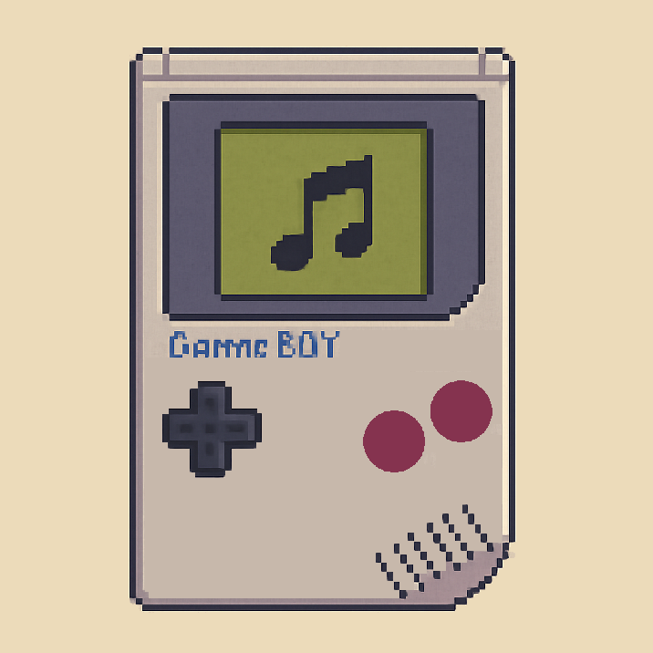
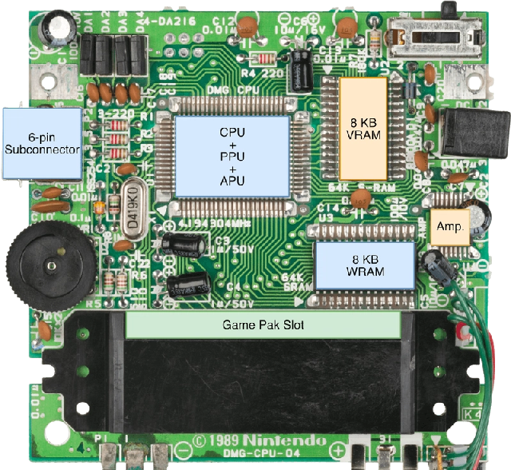
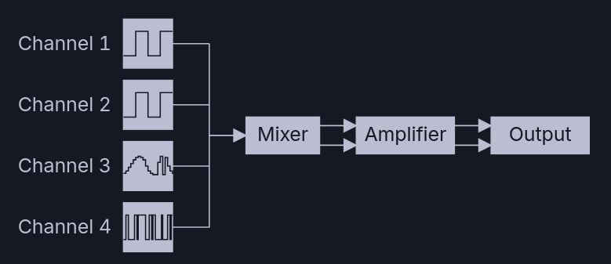
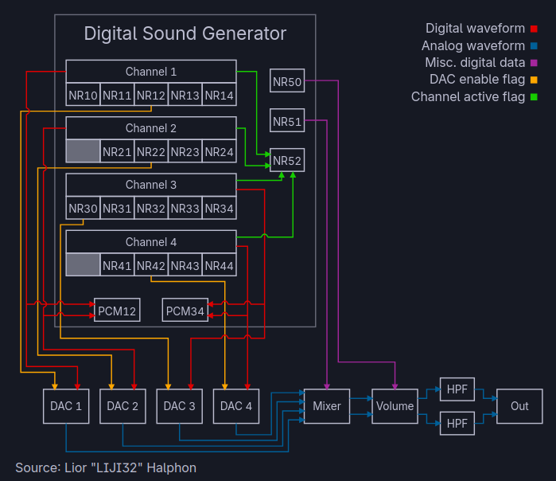
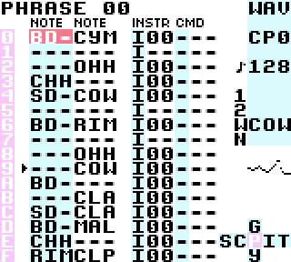

<!--
Build with:
marp lsdj_presentation.md --pdf --allow-local-files
-->

# Little Sound DJ (LSDJ)

## Chiptune on Game Boy

2025-05-18 | SWEC 2025

**Simon Weis**

---



---

# Why Game Boy?

- Limited hardware → creative constraints
- Unique 4-bit sound
- Portable music studio
- Nostalgic appeal
- Active chiptune community

---



---

# Game Boy Audio System



---

# Four Channels (monophonic)

- Pulse-based channel with sweep function
- Pulse-based channel without sweep
- Wave based channel
- Noise channel

---

# The APU

- Clocked by the master clock (runs faster on SGB1)
- 4 Bit Volume register and DAC
- Internally uses Durations instead of Frequencies

---



---

```
Step   Length Ctr  Vol Env     Sweep
---------------------------------------
0      Clock       -           -
1      -           -           -
2      Clock       -           Clock
3      -           -           -
4      Clock       -           -
5      -           -           -
6      Clock       -           Clock
7      -           Clock       -
---------------------------------------
Rate   256 Hz      64 Hz       128 Hz
```

---

# LSDJ



---

# Demo

---

# Resources

- [Official LSDJ Website](https://www.littlesounddj.com/)
- [LSDJ Wiki](https://littlesounddj.fandom.com/)
- [Kits (Samples)](https://github.com/psgcabal/lsdj-kits)
- [Community Forum](https://www.littlesounddj.com/forum/)
- [gbdev.io](https://gbdev.io/pandocs/Audio.html)

---

# Thank You!
k