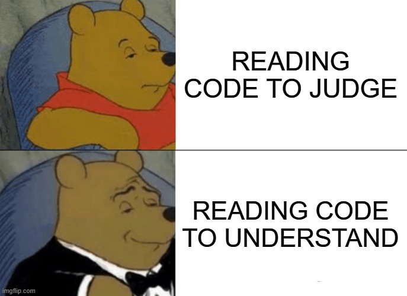

<!--
Build with:
npx @marp-team/marp-cli@latest 2025-6-03_CodeReadingWorkshop.md --pdf --allow-local-files
-->

# Code Reading Workshop

2025-06-03

---

# Introduction

- We spend more time **reading** code than **writing** code
- We don't practice reading code much
- What if we practice reading code explicitly?

---

# Further References

> A Code Reading Club is half Book Club, half Escape Room

- [Code Reading Club](https://codereading.club/)
- [Code Reading Club – Felienne Hermans](https://www.felienne.com/archives/6472)
- [GitHub - CodeReadingClubs/Resources](https://github.com/CodeReadingClubs/Resources)
- [Benefits of joining a Code Reading Club - Marit van Dijk](https://maritvandijk.com/code-reading-club/)

---

# Expectations

---

# Expectations II

- Unfamiliar Code
- Series of Exercises
	- From "First Impression"
	- To "Getting a good understanding"

---

# Expectations III

- No correct answers
- Part of the workshop is to learn how others think about code
- There are different instincts and strategies, all are valid

---

# Exercise 1: First Glance

- Practice to get a quick first impression of the code
- It doesn't matter how trivial your findings are
- This is about the immediate reaction

---

# Glance at the Code (1 min)

- Note down the **first**, **second** and **third** thing that catches your eye
- Use the reminder of the minute to think about **why** you picked those

---

# Discussion

- Talk about why you picked your points
- How do those observations help with deciding what to look for next
- Are there lines or statements that were chosen by everyone vs by only a few?
- What is the domain, framework and programming language?
- What knowledge do you think is required to better understand the code?

---

# Dependency Graph

- Unfamiliar code can be scary 👻
- Having a concrete activity to do will help!
- Creating a dependency graph visualizes the structure

---

# Examine the Code (5 min)

Variables
- Underline all the variables

Functions
- Circle all the function definitions

Classes
- Square all the class definitions

Draw a link between the definitions and their usage(s)

---

# Discussion

- Where there any problems?
- Are there any patterns visible?
- How does the data flow through the code?
- What parts of the code seem to warrant more attention?

---

# Discussion

- What is the structure of this code?
- What about the nesting level?
- Are whitespaces used to structure the code?
- What other *anchors* can you use?

---

# Sidetrack: IDE Support

- Code is often not read linearly

Good IDEs support via
- Syntax highlighting
- Search
- Peek (go to definition)
- Collapse/Expand
- ...

---

# Find Concepts (5 min)

- What are the three most important concepts in the code?
- Could be names, classes, functions, variables, algorithms, data structures, assumptions or techniques

There is no correct answer here.

---

# Discussion

- Topics covered by many vs by few
- What strategies were used to decide?

---

# Most Important Lines (3 min)

- Find the three most important lines

---

# Discussion

- What lines are covered by many people?
- Discuss why particular lines were chosen
- Can we agree as a team?

---

# Summary (5 min)

- Try to write down the concise essence of the code in no more than three short sentences.

---

# Discuss

- What strategies were used to come to a summary?
- Does the team agree?

---

# Retrospective

- Take a few moments to reflect on the session
- What methods felt good, what felt awkward?
- What did you learn?
- How can you apply what you have learned in your daily work?
