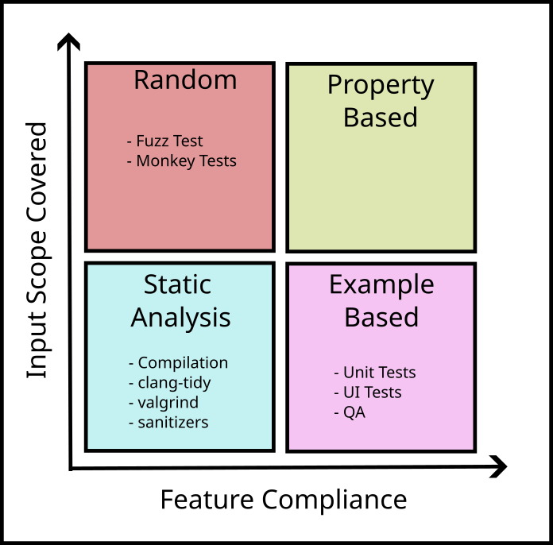

<!--
Build with:
npx @marp-team/marp-cli@latest 2025-06-17_PropertyBasedTesting.md --pdf --allow-local-files
-->

# Property Based Testing

2025-06-17

---

# How to Prove Correctness of the Code?

---

---

# Existing Issues I

- Static Analysis ignores domain and use cases
---

# Existing Issues II

- Unit tests only test the inputs we create
- Limited Code coverage
- Often focuses on implementation details (brittle)

---

# Existing Issues III

- Random Tests are often hard to set up
- Time consuming to run

---

# Property Based Testing

 > PBT is a testing method that verifies general properties or invariants by utilizing generated input data.

---

# Benefits

- Easy to write
- Cover the scope of all possible inputs
- Smart about selecting values
- Give minimal failing example (shrink)
- Deterministic

---

# History Lesson

- First research in 1990
- Popular Library: QuickCheck (Haskell) around 2000
- Growing acceptance for various languages

---

# Rapidcheck I

> QuickCheck clone for C++ with the goal of being simple to use with as little boilerplate as possible.

---

# Rapidcheck II

- Integration with gtest, catch2 and others
- Support for STL types
- Create your own generators for custom types
- Shrinking
- Stateful testing

---

# Example 1

## String Concatenation

---

## Finding Properties

- Finding properties is the most difficult part
- Consider the `cool_sort` function
- What are possible properties?

---

# Example 2

## Sort Function

---

# Shrinking

- *Randomly* generated input can be complex
- A failing test is often hard to interpret
- Shrinking provides the minimal failing example

---

# Shrinking Internal Steps

1. Generate random input
2. Test if the input fails the property
3. Systematically produce "simpler" candidates
4. -> 2.

---

# Example 3

## Shrinking

---

# Misc

- Tagging:
	- `RC_TAG`
	- `RC_CLASSIFY`
- Preconditions
	- `RC_PRE`
- `rc::gen()`

---

# Summary

- No replacement for Unit Tests, but a great addition
- Many existing unit tests can benefit from using generated input

---

# References

- [An introduction to property based testing \| F# for fun and profit](https://fsharpforfunandprofit.com/pbt/)
