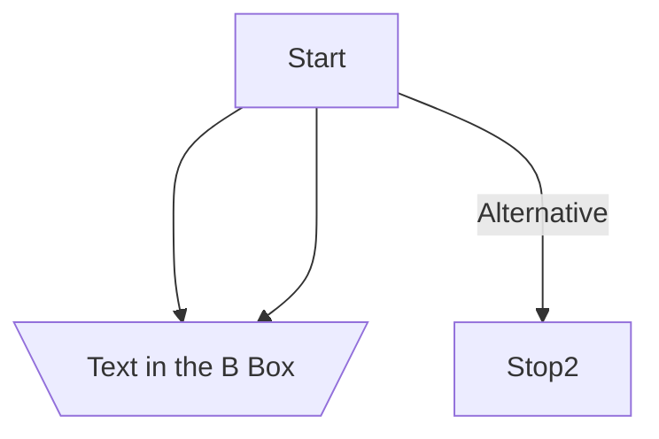
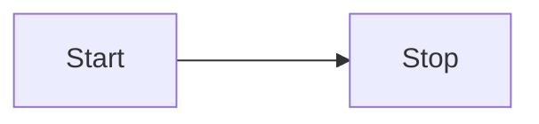
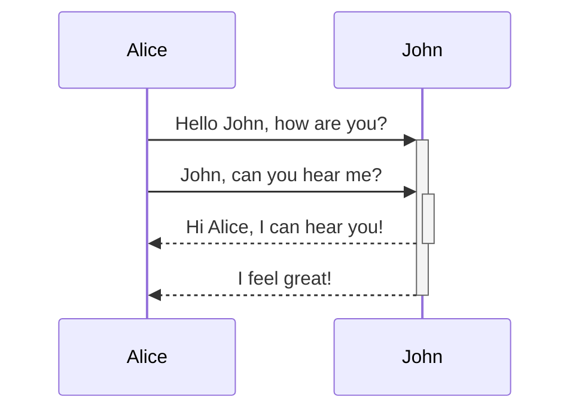

Very useful diagrams, can be displayed directly in [[Obsidian]].

[Mermaid](http://mermaid.js.org/#/) seems to be a valid alternative to [[plantuml]].

# Examples
## Graph 

graph can be followed by `TD` (top-down) or `LR`(left right)

## Sequence Diagram

